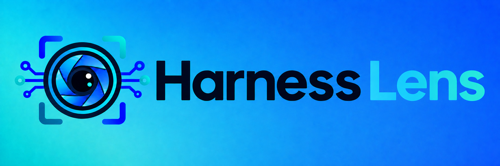
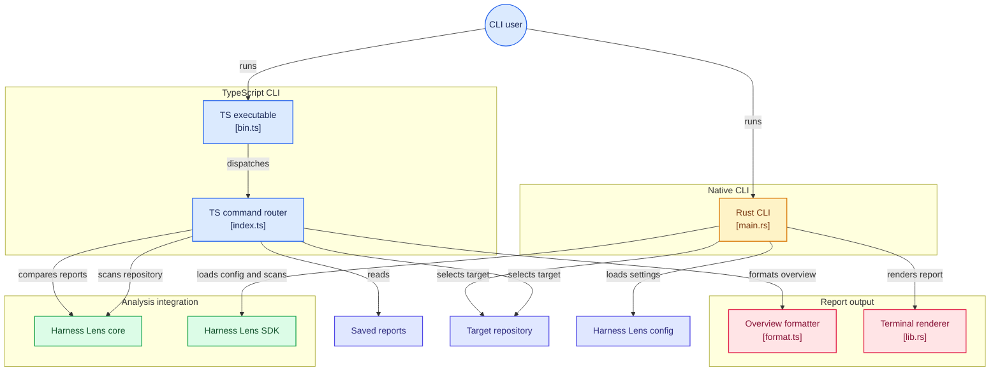

> SPDX-License-Identifier: MPL-2.0
> Copyright © 2026 Cristian Camargo Filho



# @harness-lens/cli

Terminal adapters for Harness Lens structural analysis. The native Rust binary
under [`rust/`](rust/) is the reference CLI; the existing TypeScript package
remains available to npm users.

```bash
npx @harness-lens/cli scan . --profile coding-agent/v1
npx @harness-lens/cli scan . --json
npx @harness-lens/cli scan . --input-cost-per-million-tokens 2.5 --invocations 100 --cost-reference provider/model-input-rate
npx @harness-lens/cli tui .
npx @harness-lens/cli compare before.json after.json
```

`scan` and the initial overview renderer are functional. The first `tui` command renders the same overview without an interactive event loop. Tabs, persistence, and Git-revision snapshot loading are planned.

The JSON and native CLI reports expose exact-duplicate counts, per-source byte
and token measurements, soft size/token budget findings, and—when configured—
input cost per invocation and total input cost.

The native CLI reads the same evaluation settings from `harness-lens.toml`:

```toml
[evaluation]
invocations = 100
input_cost_per_million_tokens = 2.5
cost_reference = "provider/model-input-rate"
```

`--ai` never changes deterministic findings or metrics. Until an interpreter is configured, it emits a notice and preserves the report.

Bootstrap order: publish `@harness-lens/core@0.0.1` before this package.

The Rust CLI pins an immutable revision of the
[`harness-lens/sdk`](https://github.com/harness-lens/sdk), keeping filesystem and
analysis behavior out of the terminal adapter.

## Ecosystem

- [Core](https://github.com/harness-lens/core)
- [SDK](https://github.com/harness-lens/sdk)
- [Language Server](https://github.com/harness-lens/language-server)
- [VS Code](https://github.com/harness-lens/harness-lens-vscode)
- [Project hub](https://github.com/harness-lens/harness-lens)

## Diagram Flow Chart



## Development

```bash
npm install
npm test
npm run check

cd rust
cargo test --locked
cargo run -- --version
```

## Native releases

The release pipeline builds native macOS, Windows, and Linux archives with
SHA-256 checksums, CycloneDX SBOMs, and signed GitHub attestations. Those same
reviewed archives drive the Homebrew, WinGet, Scoop, and Chocolatey packages;
the GHCR scanner image is published last. See
[`docs/distribution.md`](docs/distribution.md) for the exact artifacts, review
gate, registry handoffs, container restrictions, and retention policy.

## Language package placeholders

Buildable staging packages for the future Go and C/C++ implementations live in
[`placeholders/`](https://github.com/harness-lens/cli/tree/main/placeholders).
They document what can actually be reserved in each ecosystem and are intended
to move into dedicated repositories before their first public release.

## License

Early namespace-reservation versions used BSD-3-Clause. The official functional
implementation is licensed under MPL-2.0. When Covered Software is distributed,
modified MPL-covered files must remain available in Source Code Form under the
license. See [LICENSING](LICENSING.md), [COPYRIGHT](COPYRIGHT), and
[TRADEMARKS](TRADEMARKS).
